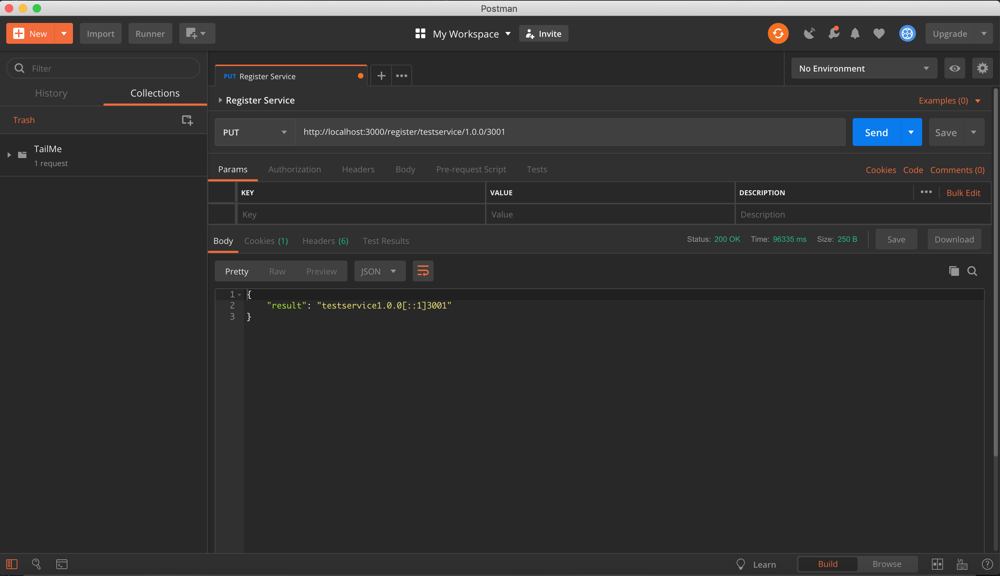
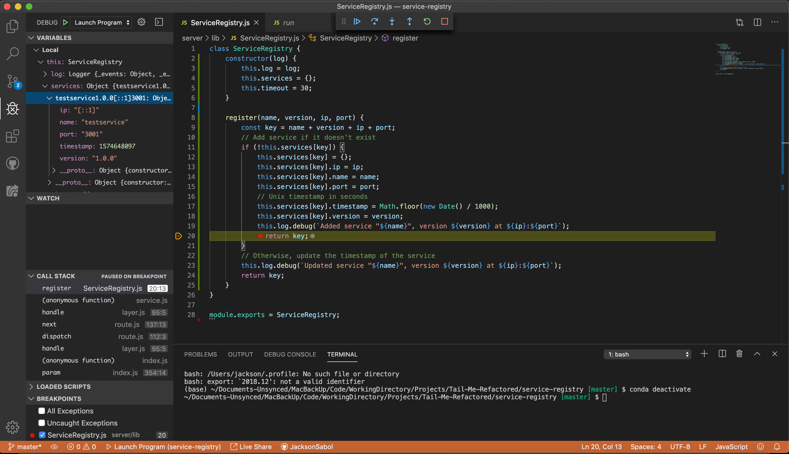

# 

## *A Management System Designed for Dog Walkers*

### The following project is a refactor of [the existing TailMe app](https://github.com/JacksonSabol/Tail-Me-App) that leverages a microservice architecture with [Node.js](https://nodejs.org/) and [Express.js](https://expressjs.com/) to provide professional dog walkers a better way to manage their own business.

TailMe is a service for professional dog walkers, dedicated to providing a premium experience to their clients, better and easier management of their business, and keeping puppies happy and well exercised. Here at TailMe, we know the challenges of running a small business that you love, and we strive to help you keep your schedules filled and your clientele satisfied. To that end, we've developed a tool that allows you to intake chosen users, interact with them more meaningfully, manage accounts with greater effeciency and, if you choose, grow your business. Join us and help keep more healthy tails wagging!  

## Test-Driven Development
TailMe is dedicated to providing users with a robust and error-free. To that end, this refactor focuses on test-driven development utilizing tools such as [Postman](https://www.getpostman.com/), [Mocha](https://mochajs.org/), [Chai](https://www.chaijs.com/), [Instanbul](https://istanbul.js.org/), and the [Visual Studio Code debugger](https://code.visualstudio.com/docs/editor/debugging).
### Testing the registration of a service with VS Code Debugger using Postman for HTTP calls
  
  

